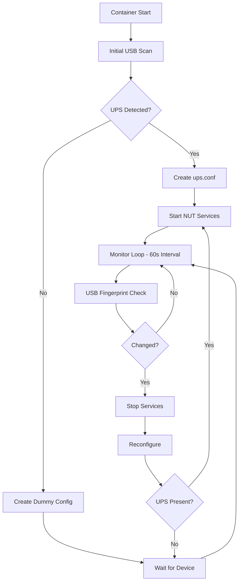

# NUT Smart Hotplug Docker Implementation

This directory contains the **Smart Hotplug** version of the Network UPS Tools (NUT) 2.8.4 container, specifically designed for reliable USB UPS hotplug detection on ARM64 Raspberry Pi systems.

## Overview

The Smart Hotplug implementation provides:

✅ **True USB Hotplug Support** - Automatically detects UPS connection/disconnection  
✅ **Intelligent Change Detection** - Only restarts when devices actually change  
✅ **Multi-UPS Compatibility** - Works with various UPS brands and models  
✅ **Dashboard Compatibility** - Always exposes UPS as `my-ups` for consistent access  
✅ **Stability Focus** - 60-second scan interval prevents excessive monitoring  

## Quick Start

### 1. Build the Image

```bash
# From the project root directory
docker buildx build --platform linux/arm64 -f docker-hotplug/Dockerfile -t ups-nut-smart:latest --load .
```

### 2. Run with Docker Compose

```bash
cd docker-hotplug
docker compose up -d
```

### 3. Monitor Logs

```bash
# View container logs
docker logs -f ups-nut-smart

# View hotplug-specific logs
docker exec ups-nut-smart tail -f /var/log/nut/hotplug.log
```

## Files in this Directory

| File | Description |
|------|-------------|
| `Dockerfile` | Multi-stage build for ARM64 with complete NUT 2.8.4 installation |
| `entrypoint.sh` | Smart hotplug detection script with USB device fingerprinting |
| `docker-compose.yml` | Production-ready compose configuration |
| `README.md` | This documentation file |

## Configuration

### Environment Variables

| Variable | Default | Description |
|----------|---------|-------------|
| `SCAN_INTERVAL` | `60` | USB scanning interval in seconds |
| `DEBUG` | `1` | Enable debug logging (0 to disable) |
| `TZ` | `UTC` | Timezone for log timestamps |

### Volume Mounts

| Host Path | Container Path | Description |
|-----------|----------------|-------------|
| `ups-nut-state` | `/var/run/nut` | NUT runtime state and driver sockets |
| `ups-nut-logs` | `/var/log/nut` | Hotplug and NUT service logs |
| `/run/udev` | `/run/udev:ro` | udev information for device detection |

## How It Works

### Smart Detection Algorithm

1. **USB Device Fingerprinting**: Creates unique signatures of connected UPS devices
2. **NUT Scanner Integration**: Uses `nut-scanner -U` for reliable UPS detection  
3. **Fallback Detection**: Falls back to `lsusb` pattern matching for broader compatibility
4. **Change Comparison**: Only triggers restarts when device fingerprints actually change

### Hotplug Workflow



## Supported UPS Devices

The smart hotplug system works with **any UPS supported by NUT 2.8.4**, including:

- **EcoFlow** series (EF-UPS-DELTA, etc.)
- **APC** Smart-UPS and Back-UPS series
- **CyberPower** UPS systems
- **Tripp Lite** UPS devices
- **Any HID-compatible USB UPS**

Detection is **not hardcoded** to specific vendor IDs - it uses NUT's native detection capabilities.

## Troubleshooting

### Common Issues

**1. "exec /entrypoint.sh: no such file or directory"**
- **Cause**: Windows line endings (CRLF) in the entrypoint script
- **Solution**: Rebuild after running `sed -i 's/\r$//' docker-hotplug/entrypoint.sh`

**2. "libusb1: Could not open any HID devices: insufficient permissions"**
- **Cause**: USB device permissions issue
- **Solution**: Ensure container runs with `privileged: true` and proper device mounts

**3. "Data for UPS [my-ups] is stale - check driver"**
- **Cause**: UPS was unplugged but services haven't detected the change yet
- **Solution**: Wait for next scan cycle (max 60 seconds) or check USB connections

**4. Excessive Restarts**
- **Cause**: Scan interval too low or false positive detection
- **Solution**: Increase `SCAN_INTERVAL` or check USB device stability

### Debug Commands

```bash
# Check USB devices
docker exec ups-nut-smart lsusb

# Test NUT scanner
docker exec ups-nut-smart /opt/nut/bin/nut-scanner -U

# Check UPS status
docker exec ups-nut-smart /opt/nut/bin/upsc my-ups

# View configuration
docker exec ups-nut-smart cat /opt/nut/etc/ups.conf

# Monitor real-time logs
docker exec ups-nut-smart tail -f /var/log/nut/hotplug.log
```

## Performance Characteristics

| Metric | Value | Notes |
|--------|-------|-------|
| **Memory Usage** | ~80-120MB | Higher than static due to monitoring |
| **CPU Impact** | <1% average | Minimal during normal operation |
| **Scan Frequency** | 60 seconds | Configurable via `SCAN_INTERVAL` |
| **Startup Time** | 30-60s | Depends on USB device detection |
| **Detection Latency** | 0-60s | Maximum time to detect changes |

## Migration from Static Version

To migrate from a static NUT setup:

```bash
# Stop existing container
docker compose -f your-static-compose.yml down

# Start smart hotplug version
cd docker-hotplug
docker compose up -d

# Monitor transition
docker logs -f ups-nut-smart
```

**Benefits over static setup:**
- ✅ Automatic UPS reconnection after power events
- ✅ Support for swapping between different UPS models
- ✅ No manual intervention required for USB replug scenarios
- ✅ Dashboard continues working during device changes

## Development and Customization

### Custom UPS Detection

To add custom UPS detection patterns, modify the `get_ups_fingerprint()` function in `entrypoint.sh`:

```bash
# Add custom vendor ID patterns
fingerprint=$(lsusb | grep -E "(3746:ffff|YOUR_VENDOR_ID)" | sort)
```

### Adjusting Scan Behavior

Modify scan intervals and behavior by setting environment variables:

```yaml
environment:
  - SCAN_INTERVAL=30    # More frequent scanning
  - DEBUG=0            # Disable debug logging
```

### Advanced Configuration

For advanced use cases, mount custom configuration files:

```yaml
volumes:
  - ./custom-config:/opt/nut/etc
  - ups-nut-state:/var/run/nut
  - ups-nut-logs:/var/log/nut
```

## Contributing

When contributing improvements to the smart hotplug system:

1. **Test thoroughly** with different UPS models
2. **Maintain backward compatibility** with existing dashboard integrations
3. **Document changes** in this README
4. **Consider performance impact** of detection algorithms
5. **Ensure Unix line endings** for all shell scripts (`dos2unix` or `sed -i 's/\r$//'`)

## License

This implementation follows the same licensing as the main NUT project. See the project root for license details.